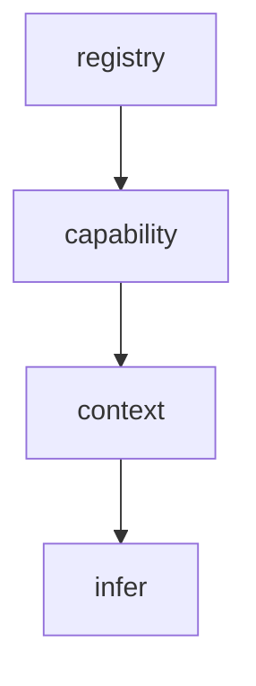

# 03 Core Components

## Warum dieses Kapitel?

In einem MCP-System sind nicht alle Fähigkeiten gleich wichtig.

Es gibt **vier essentielle Kernfunktionen**, ohne die keine sinnvolle Interaktion, kein Lernen und kein Fortschritt stattfinden kann.  
Diese Komponenten bilden das **Rückgrat jeder MCP-Instanz** – sie müssen zuerst verstanden und implementiert werden.

---

## Die vier Kernkomponenten im Überblick

| Komponente   | Funktion                                         | Beispiel-Implementierung              |
|--------------|--------------------------------------------------|----------------------------------------|
| `registry`   | Kennt alle registrierten Komponenten             | `config/mcp_register.yaml`            |
| `capability` | Steuert, was erlaubt ist                         | `config/mcp_permissions.json` + Rules |
| `context`    | Lädt, speichert, modifiziert Kontextdaten        | `data/context_store.json`             |
| `infer`      | Wendet LLM auf Kontext oder Anfrage an           | `mcp_components/mintycoder/server.py` |

---

## 1. `registry`: Was ist verfügbar?

**Pfad:** `config/mcp_register.yaml`

### Beispiel:
```yaml
- id: mintycoder
  type: llm_agent
  entrypoint: http://localhost:8001/mcp/infer
  capabilities:
    - infer
    - context.load
  autostart: true
  monitor: true
```

> Die Registry ist die einzige "Quelle der Wahrheit" über die aktiven Komponenten im Stack.

---

## 2. `capability`: Was ist erlaubt?

**Pfad:** `config/mcp_permissions.json`

### Beispiel:
```json
{
  "phase_1": ["infer", "context.load"],
  "phase_2": ["context.save", "tool.shell.run"]
}
```

> Diese Fähigkeitensätze werden mit `capabilities.rules.yaml` validiert  
> und ermöglichen eine **Whitelist-basierte Steuerung** der Agentenlogik.

---

## 3. `context`: Was ist der Zustand?

**Pfad:** `data/context_store.json`

Einfaches Beispiel (JSON):
```json
{
  "user_goal": "Erstelle einen Shell-Wrapper für Ollama",
  "llm_choice": "deepseek-coder",
  "phase": "2"
}
```

> Wird von `context.load`, `context.save`, `context.merge` genutzt  
> und kann auch über HTTP manipuliert werden (`/context/get` etc.)

---

## 4. `infer`: Wie erfolgt die Ausgabe?

**Pfad:** `mcp_components/mintycoder/src/server.py`

Ein Beispiel-Server, der `ollama run <modell>` auf den übergebenen Prompt anwendet:

```python
@app.post("/mcp/infer")
async def infer(request: Request):
    prompt = (await request.json()).get("context", "")
    result = subprocess.run(["ollama", "run", MODEL], input=prompt.encode(), ...)
    return {"result": result.stdout.decode()}
```

> Diese Komponente ist dein Einstiegspunkt für AI-Funktionalität  
> und kann mit jeder LLM-Quelle verbunden werden (lokal, remote, API).

---

## Zusammenspiel der 4 Komponenten



- `registry`: kennt alle Komponenten
- `capability`: legt fest, welche davon aktiv sein dürfen
- `context`: liefert Input & speichert Output
- `infer`: führt Aufgaben mit Hilfe eines Modells aus

---

## Ergebnis

Nach dieser Seite kannst du:
- ein MCP-System minimal aufbauen,
- Registry, Fähigkeiten, Kontext und Infer-Komponenten korrekt strukturieren,
- die Kontrolle über Agentenfähigkeit explizit und nachvollziehbar steuern.

---

## 🧩 Prompt-Baustein: Neue Kernkomponente anlegen

Verwende diesen Prompt, um eine neue MCP-Komponente mit einer der vier Kernfähigkeiten zu erstellen:

```
Ich entwickle ein MCP-System mit komponentenbasierter Architektur.

Bitte erstelle eine neue MCP-Komponente im Verzeichnis `mcp_components/`  
mit dem Namen <komponentenname>, z. B. `contextmanager`.

Die Komponente soll folgende Fähigkeit bereitstellen:
<z. B. context.save>

Erstelle:
- `component.meta.yaml` mit allen Pflichtfeldern
- `config.yaml` mit einem Basiswert
- `src/<file>.py` mit einem minimal lauffähigen Endpoint (FastAPI)
- Einen passenden Eintrag in `mcp_register.yaml` (autostart: false)

Alle Dateien sollen konform zu `structure.rules.yaml` und `capabilities.rules.yaml` sein.
```

---

## Nächster Schritt

👉 Kapitel `04_capabilities_and_policies.md`:  
Wie Fähigkeiten kontrolliert, limitiert oder freigegeben werden – und wie man systemische Policies umsetzt.
