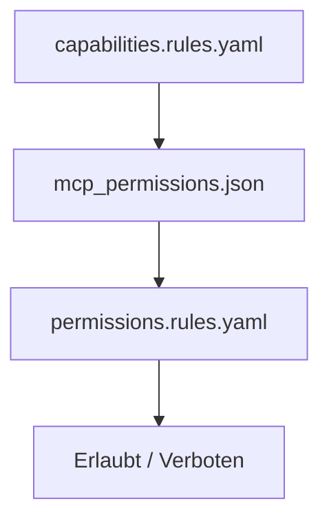

# 04 Capabilities and Policies

## Warum dieses Kapitel?

Ein MCP-System ist nicht nur modular – es ist auch **kontrolliert**.

Fähigkeiten wie `context.save`, `tool.shell.run` oder `infer` sollten **nicht automatisch** jedem Agenten zur Verfügung stehen.  
Stattdessen arbeitest du mit:

1. **Capabilities** = Was *prinzipiell* existiert
2. **Permissions** = Was *konkret erlaubt* ist
3. **Policies** = Wann und unter welchen Bedingungen was genutzt werden darf

---

## 1. Capabilities – das globale Fähigkeitsverzeichnis

**Pfad:** `config/rules/capabilities.rules.yaml`

### Beispiel:
```yaml
infer: Führt ein LLM-Modell mit einem gegebenen Kontext aus
context.load: Lädt gespeicherte Kontexte aus dem System
context.save: Speichert den aktuellen Kontextstatus
tool.shell.run: Führt einen Shell-Befehl mit Kontextdaten aus
```

> Diese Datei ist die offizielle Referenz – auch für die GUI und Autocomplete-Tools.

---

## 2. Permissions – was ist aktuell erlaubt?

**Pfad:** `config/mcp_permissions.json`

Hier definierst du **kontextabhängig**, **phasenbasiert** oder **agentenbasiert**,  
welche Fähigkeiten aktiv sind.

### Beispiel:
```json
{
  "phase_1": ["infer", "context.load"],
  "phase_2": ["context.save", "tool.shell.run"]
}
```

> Das erlaubt dir, sensible Aktionen wie `tool.shell.run` nur in bestimmten Entwicklungsphasen zuzulassen.

---

## 3. Policies – systemische Einschränkungen

Du kannst mit `config/rules/permissions.rules.yaml` feingranular steuern,  
unter welchen Bedingungen bestimmte Fähigkeiten **automatisch blockiert** werden.

### Beispiel: Policy-Logik (pseudoyaml)

```yaml
- if: agent.id == "explorer"
  then: deny
  capabilities:
    - tool.shell.run

- if: phase < 2
  then: deny
  capabilities:
    - context.save
```

> Diese Regeln können in `mcp_permissions.json` live angewendet oder von einem Policy-Agenten validiert werden.

---

## Zusammenfassung als Fluss



---

## Ergebnis

Du kannst jetzt:
- das globale Fähigkeitsinventar erweitern
- regeln, wann etwas erlaubt ist
- Agenten gezielt auf bestimmte Operationen beschränken
- alle Fähigkeiten im System klar versionieren und nachvollziehen

---

## 🧩 Prompt-Baustein: Neue Fähigkeit oder Policy einfügen

Verwende diesen Prompt, um dein MCP-System gezielt zu erweitern:

```
Ich arbeite mit einem regelgesteuerten MCP-System.

Bitte füge eine neue Fähigkeit mit der ID <capability_id> in `capabilities.rules.yaml` ein.

Beschreibung: "<z. B. Führt eine API-Anfrage an ein Drittsystem aus>"

Ergänze zusätzlich:
- Ein Beispiel für die Nutzung in `mcp_permissions.json` für phase_3
- Optional: Eine Einschränkungsregel in `permissions.rules.yaml`, z. B. basierend auf Agent-ID

Stelle sicher, dass alle Einträge maschinenlesbar und konform zu bestehenden Formaten sind.
```

---

## Nächster Schritt

👉 Kapitel `05_component_creation.md`:  
Wie du mit einem einzigen Prompt eine lauffähige MCP-Komponente erzeugst – inklusive API, Metadaten und Test.
