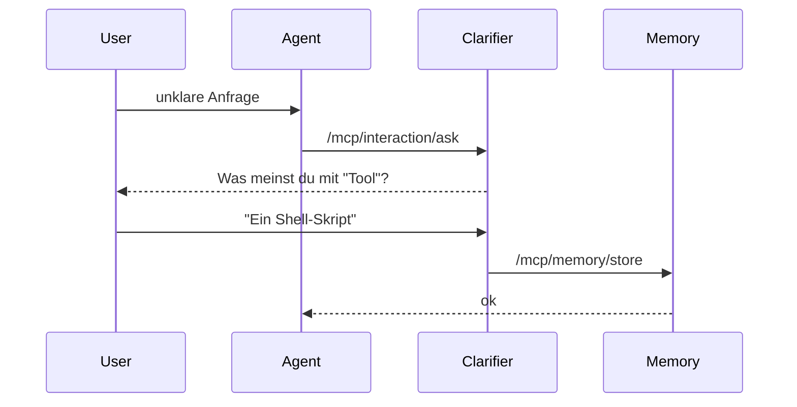

# 06 Interaction and Memory

## Warum dieses Kapitel?

Ein Agent, der nicht nachfragt, versteht oft nicht genug.  
Ein Agent, der sich nichts merkt, lernt nichts dazu.

Dieses Kapitel zeigt dir, wie du:
- **Rückfragen**, **Reflexionen** und **Mehrschrittgespräche** steuerst,
- Agenten ein **Memory** gibst, das über Sitzungen hinaus funktioniert,
- alle nötigen Fähigkeiten (`interaction.ask`, `memory.store`, `memory.recall`) in dein System integrierst.

---

## 1. Rückfragen und Mehrschrittkommunikation

### Fähigkeit: `interaction.ask`

Agenten, die `interaction.ask` registriert haben, dürfen **Fragen an den Benutzer stellen**, z. B.:
- zur Klärung unpräziser Anforderungen,
- bei fehlenden Parametern,
- zur Entscheidung zwischen Optionen.

### Beispiel-Komponente

```plaintext
mcp_components/clarifier/
├── src/clarifier.py
├── config.yaml
└── component.meta.yaml
```

```python
@app.post("/mcp/interaction/ask")
async def ask(request: Request):
    q = (await request.json()).get("question", "")
    print(f"🤖 Frage an User: {q}")
    return {"awaiting_input": True}
```

> In der Praxis wird diese Fähigkeit durch ein Frontend oder GUI-Callback bedient.

---

## 2. Memory: Wissen behalten und abrufen

### Fähigkeiten:

| Capability         | Funktion                         |
|--------------------|----------------------------------|
| `memory.store`     | Speichert Inhalte im Memory-Store |
| `memory.recall`    | Ruft frühere Inhalte ab           |

### Speicherformat (z. B. `data/memory_store.json`)

```json
{
  "user_name": "Alex",
  "project_goal": "Ein CLI-Tool für Kontexterweiterung",
  "last_question": "Wie strukturiere ich den Speicherzugriff?"
}
```

---

## 3. Beispiel: Memory-Komponente

```plaintext
mcp_components/memory_manager/
├── src/memory.py
├── config.yaml
└── component.meta.yaml
```

```python
@app.post("/mcp/memory/store")
async def store(request: Request):
    new_data = await request.json()
    with open("data/memory_store.json", "r+") as f:
        data = json.load(f)
        data.update(new_data)
        f.seek(0)
        json.dump(data, f)
    return {"status": "stored"}
```

> Mit nur einer Funktion baust du damit ein Langzeitgedächtnis für deinen Agenten.

---

## 4. Zusammenspiel: Rückfrage → Kontext → Memory



---

## Ergebnis

Du kannst jetzt:
- Agenten befähigen, mit dem User in Dialog zu treten
- User-Antworten speichern und wiederverwenden
- eine Memory-Engine per Prompt oder Code ergänzen

---

## 🧩 Prompt-Baustein: Rückfrage- oder Memory-Komponente erstellen

```
Ich möchte mein MCP-System um Interaktion und Memory erweitern.

Bitte erstelle eine neue Komponente unter `mcp_components/<name>/`  
für die Fähigkeit `<interaction.ask>` oder `<memory.store>`.

Die Komponente soll:
- einen FastAPI-Endpoint bereitstellen,
- auf ein JSON-Eingabeformat reagieren,
- wahlweise mit `data/memory_store.json` arbeiten,
- korrekt in `component.meta.yaml` und `mcp_register.yaml` eingetragen sein.
```

---

## Nächster Schritt

👉 Kapitel `07_tools_and_execution.md`:  
Wie dein Agent echte Arbeit übernimmt – z. B. mit Shell, API-Aufrufen oder Dateiaktionen.
